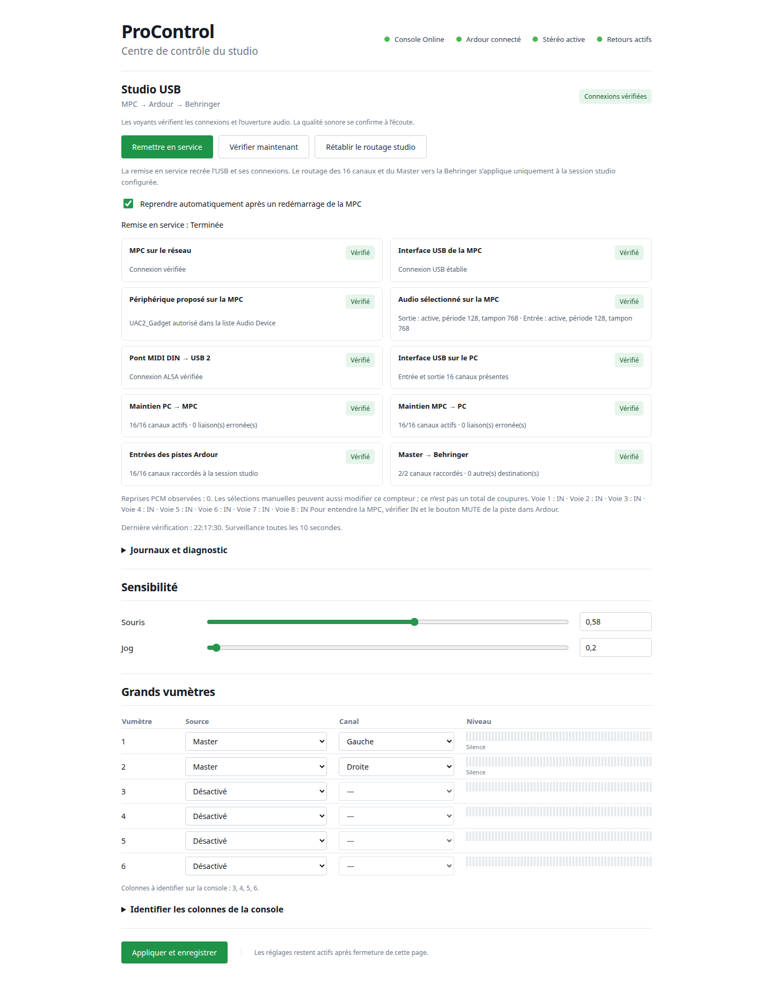

# ProControl Linux

Passerelle expérimentale libre pour la **Digidesign ProControl originale**,
développée et éprouvée sous Linux Mint avec Ardour. Première version Git :
**v0.1.0**, 15 septembre 2026.

```text
ProControl ↔ Ethernet brut ↔ procontrold ↔ OSC ↔ Ardour
                                  ↳ X11 : souris et clavier
                                  ↳ réglages web locaux
```

## Centre de contrôle USB du studio

Le panneau local de la Gateway supervise maintenant MPC, USB, Ardour et Behringer,
avec remise en service, reprise automatique et journaux. Voir le
[guide du studio USB](docs/studio-control.md) pour la configuration et les limites.

[](docs/images/gateway-studio.png)

*Interface de la Gateway en fonctionnement, le 20 septembre 2026. Cliquer sur
l’image pour l’ouvrir en grand.*

## Fonctions disponibles

- Session Ethernet Online maintenue en arrière-plan, transport et jog.
- Touches de navigation identifiées, mode zoom et bref retour lumineux des
  commandes ponctuelles ; [essais à son rythme](docs/console-test-workflow.md).
- Édition depuis la console : cuts, copie, suppression, duplication, calage,
  sélection IN/OUT, boucles, UNDO/REDO et SAVE ; [guide pratique](docs/console-editing.md).
- Huit faders motorisés bidirectionnels avec gestion du toucher, banques,
  sélection, mute, solo, armement et panoramique.
- Automatisation du gain par touche AUTO : Manual, Play, Write, Touch, Latch,
  avec les voyants correspondants.
- Écoute IN / DISK par tranche depuis MON/Ø et ASSIGN/MUTE, raccourcis
  INPUT / OUTPUT et retour AUTO par DEFAULT ; état confirmé par Ardour.
- Noms de pistes, valeurs, compteur de position, LEDs de la Channel Matrix,
  vumètres stéréo et master sur les grandes colonnes calibrées.
- Trackpad, clics, mode clavier ALPHA et pavé numérique via X11.
- Section DSP ouverte par INS/SEND sur chaque voie : EQ et compresseur ajoutés
  s’ils manquent, puis bibliothèque de huit effets avec paramètres mappés sur
  les encodeurs et afficheurs ; nécessite les patches Ardour fournis.
- Démarrage et redémarrage idempotents, réglages locaux à
  `http://127.0.0.1:8765`.

Les validations logicielles, essais dans Ardour et observations physiques sont
distingués dans les rapports. Le retour au début avec le jog en lecture et le
compteur ont été confirmés par l’utilisateur ; cela ne valide pas toute
l’endurance audio ou la synchronisation audible MPC. Voir [la revue actuelle](docs/review-2026-09-20.md),
[l’index des guides](docs/README.md) et [CHANGELOG.md](CHANGELOG.md).

## Démarrage

Python 3 (tests sous 3.12), Linux avec Ethernet brut et Ardour avec OSC activé
(port 3819 par défaut). Le pont souris/clavier utilise X11 ; Wayland n'est pas
pris en charge. L'installation actuelle est configurée pour `enp0s25` et la
MAC de la console utilisée durant le développement : adapter ces valeurs pour
une autre installation. Le projet n'est pas encore un paquet installable.

Le petit helper [procontrol-net.c](native/procontrol-net.c) permet le lancement
sans root une fois installé avec CAP_NET_RAW. Son interface autorisée est
actuellement fixée dans le code ; consulter [l'installation du helper et les
privilèges](docs/rootless-launch.md). En son absence, le lanceur utilise pkexec.

Depuis le dossier du projet :

```bash
./procontrol start
./pointer start
./settings start

./procontrol status
./pointer status
./settings status
```

Les services restent en arrière-plan. Le lanceur graphique les vérifie et
peut les redémarrer :

```bash
python3 tools/desktop_launcher.py
python3 tools/desktop_launcher.py --restart
```

Les raccourcis `.desktop` de cette machine, `settings.json`, les journaux et
les captures restent locaux. Les réglages absents utilisent les valeurs par
défaut de `tools/surface_settings.py`. Voir [le lanceur](docs/desktop-launcher.md)
et [les réglages stéréo](docs/stereo-settings.md).

## Ardour, DSP et retours

- [Édition, sélection et boucles](docs/console-editing.md)
- [Bibliothèque DSP de huit effets](docs/curated-plugins.md)
- [Contrat OSC et commandes](docs/ardour-osc-contract.md)
- [Automatisation et LEDs](docs/automation-modes.md)
- [Écoute IN / DISK depuis la console](docs/track-monitoring.md)
- [Flux EQ, compresseur et navigateur de greffons](docs/eq-plugin-workflow.md)
- [Suivi des fenêtres et correctif Ardour 9.8](docs/plugin-window-follow.md)
- [Greffons libres et chaînes de test](docs/free-plugins-selection.md)
- [Jog, cadence moteurs et reprise après perte d'ACK](docs/jog-motor-scheduling.md)
- [Protection du toucher et écho des faders](docs/fader-echo-2026-09-14.md)
- [Carte des fonctions et limites](docs/control-map.md)

Les scripts Lua se trouvent dans `ardour/` : retours stéréo et ajout de l'EQ
et du compresseur sur les pistes de test. Les modules Ardour compilés et les
sessions audio ne font pas partie du dépôt.

Le 17 septembre, un dépassement mémoire dans les retours OSC des départs a
été reproduit avec le module OSC instrumenté par AddressSanitizer. Le
[correctif de stabilité Ardour 9.8](native/ardour-9.8-osc-stability.patch)
et les corrections de reconnexion de la passerelle sont documentés dans
[le rapport de stabilité](docs/stability-2026-09-17.md). Le runtime local
corrigé démarre normalement sans préchargement ASan ; la stabilité sur une
nuit entière reste à confirmer. La disponibilité des interfaces natives
dépend des patches fournis, pas de toute installation Ardour standard.

La bibliothèque comprend aussi **Chaleur (Valve), Tube (ZamTube) et Tape (CHOW)**,
avec les commandes wow/flutter sur la console : [guide](docs/warm-tape-plugins.md).

Le [guide compteur et synchro MPC](docs/counter-mpc-sync.md) décrit le rendu
mesures/temps, le diagnostic MIDI Clock et le pont optionnel **Ardour → Ableton Link**.
Le service se pilote avec `./link start|status|stop` après installation ; son état
distingue le processus actif, le tempo transmis et les participants Link détectés.

Le [correctif jog / JACK / Link du 20 septembre](docs/jog-link-stability-2026-09-20.md)
traite l'épuisement du pool audio, la boucle de redémarrage au start et l'écart
entre le compteur OSC et la position affichée par Ardour. Il nécessite le
[patch natif complémentaire](native/ardour-9.8-jog-pool.patch) et la reconstruction
du pont Link pour conserver la lecture pendant les repositionnements JACK.

## Développement et tests

```bash
python3 -m unittest discover -s tests -v
python3 tools/mapping_inventory.py --check
python3 -m compileall -q tools tests
```

256 tests passent sur la machine de développement après l’ajout de la navigation et des voyants du 20 septembre. Les tests du helper natif
peuvent être ignorés s'il n'est pas installé ; certaines vérifications de
capture nécessitent les utilitaires Linux `ip` et `flock`. Les tests de
capture emploient un faux dumpcap et n'accèdent pas à la console réelle.

- `tools/` : session Ethernet, ordonnanceurs, mapping, OSC et services.
- `native/` : helper CAP_NET_RAW, pont Link et six patches Ardour ;
  [ordre d’application et tests natifs](native/README.md).
- `ardour/` : scripts Lua côté DAW.
- `tests/` : tests et fixtures minimales de protocole.
- `web/`, `assets/` : réglages locaux et icône.
- `docs/` : protocole, mesures, cartographie et historique des validations.
- `vendor/` : références GPL conservées avec provenance et licences.

Le [workflow GitHub](.github/workflows/checks.yml) vérifie les tests Python,
l’inventaire généré, la syntaxe, le test natif de transport Link et la compilation
du helper et du pont Link complet. Il ne pilote aucun matériel. Le test natif du
pool Ardour nécessite la bibliothèque patchée locale. Pour régénérer l’inventaire
après un changement de mapping : `python3 tools/mapping_inventory.py`.

Avant une modification des modules en service, arrêter `pointer` et
`procontrol`, puis les relancer après vérification. Un seul émetteur Ethernet
doit piloter la console. Les changements de documentation et Git ne
nécessitent pas d'arrêter les services.

## Protocole et provenance

Le protocole de la ProControl est étudié à partir des échanges réels et des
branches ProControl de ReaControl24. Le protocole Control|24 n'est pas supposé
identique. Un ACK prouve la réception d'une trame, pas le succès visuel ou
l'atteinte mécanique d'une position.

- [Recherche et projets de référence](docs/research.md)
- [Protocole et observations](docs/protocol.md)
- [Guide des captures Linux](docs/capture-linux.md)
- [Fiche d'expérience](docs/experiment-template.md)
- [Sources ReaControl24](vendor/reacontrol24/README.md)
- [Correctif du fork lazlooose](vendor/reacontrol24-lazlooose/README.md)

Les captures brutes, sauvegardes de session et photos tierces sont exclues de
Git. Certains rapports historiques référencent ces preuves locales et des
chemins propres au laptop ; leurs fichiers ne sont pas tous distribués.

Licence : **GPL-3.0-or-later**, voir [LICENSE](LICENSE). Les mentions des auteurs
et licences des sources tierces sont conservées dans `vendor/`.
