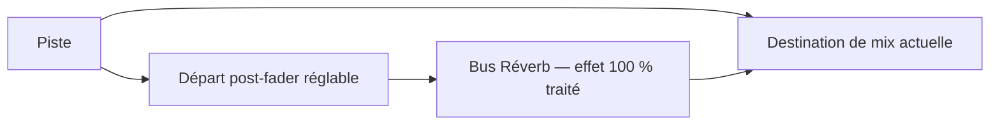

# Channel / Group : neuvième afficheur DSP et préparation des départs

Date : 27 septembre 2026. Demande : rétablir l'afficheur situé sous les huit
rotatifs DSP, au-dessus de CHANNEL / GROUP, avant d'installer les départs
Réverb/Delay dans la session Ardour.

## Découverte et limites

Le test du 14 septembre adressait seulement `0x0d..0x14` et `0x2d..0x34`.
La photo validait les huit rotatifs ; **elle ne testait pas Channel / Group**.
L'inventaire `dsp.channel` avait donc une sortie inconnue et aucun producteur
de texte. Aucun bus d'effet ni départ audio n'est créé par cette intervention.

L'analyse du firmware établit un neuvième emplacement DSP à `0x15`, également
accessible par `0x35`. L’utilisateur confirme ensuite le texte `MPC01-02` sur Channel / Group :
la destination physique de `0x35` est validée. Un ACK seul ne le prouvait pas.

L'utilisateur confirme pendant cette intervention que cet afficheur fonctionne
parfaitement dans le test LED / mode Vegas du menu Utility. C'est une
confirmation de fonctionnement matériel, distincte du texte réseau `0x35`.

## Méthode et provenance

- Image : COMv1.37, acquisition cumulative reconstruite de 65 536 octets,
  base `0x20000`, SHA-256
  `9a24da8fc2ea58d33fc11a2dc28f6d1fb556dc422a0ec2cd254d605a2d501c48`.
  Provenance : [double acquisition du programme comm](comm-application-complete-2026-09-21.md).
- Fichier local :
  `work/firmware-research-20260920/comm-application-restored-rebuilt/pass-1-comm-00020000.bin`.
- GNU objdump m68k 2.42, mode `m68k:68020`. Analyse ciblée, sans lecture de
  mémoire supplémentaire, sans écriture de firmware et sans diagnostic actif.
- `0x2a574..0x2a5ea` : commande texte `f0 13 00 40`, indice `adresse & 0x1f`,
  ligne `(adresse & 0x20) >> 5`, caractères transmis à `0x25d8c`.
- `0x25d8c..0x25e9a` : indices `0..7` pour les tranches (ligne utilisée),
  puis **`13..21` inclus** pour le DSP (ligne ignorée). Chaque emplacement
  contient huit caractères convertis en cinq colonnes graphiques chacun.
- Neuvième DSP : indice 21, offset `(21 - 13) * 40 = 320` dans le tampon DSP.
  L'adresse `0x28` devient l'indice 8, non accepté : le pointeur reste nul et
  la routine retourne sans afficher. `0x15` et `0x35` sont des alias dans
  ce chemin du firmware ; cela complète la limite historique sur la série A.

Commande texte retenue :

```text
f0 13 00 40 35 00 [8 caractères ASCII] f7
```

## Essais actifs et preuves réseau

Émetteur unique : passerelle PID 164931, verrou réellement hérité sur
`run/daemon.lock`, descripteur 3. Console Online, Ardour PID 173019 répondant.
Les essais utilisent le RPC existant `mapping/probe`, élément `dsp.channel`,
famille `display`, adresse temporaire ; durée 2 secondes par répétition,
effacement automatique puis nouvelle répétition toutes les 2,5 secondes.
Aucune calibration permanente enregistrée par ces essais.

1. `0x28`, 15:10:20–15:11:20 UTC : 24 répétitions. L'utilisateur répond
   **« Aucun changement visible »**. Capture
   `captures/20260927T151019Z-channel-group-28-y2UXyo/traffic.pcap`,
   SHA-256 `877f93fc036ee7118fe8428b1a3228a003eab5dcb5d2832da231dbdee4fc36fb`.
   132 trames, 127 ProControl, 127 sommes concordantes ; 48 commandes texte
   et effacement, 48 ACK. Exemple : texte trame 1 / ACK 2 ; dernier effacement
   121 / ACK 122. Dumpcap : zéro perte. Résultat négatif conservé.
2. `0x35`, à partir de 15:11:51 UTC : 8 répétitions demandées. La capture a
   commencé pendant la troisième répétition ; ne pas lui attribuer les deux
   premières. Fichier
   `captures/20260927T151157Z-channel-group-35-IIbepO/traffic.pcap`,
   SHA-256 `ba71f7aefa7d1f1d2c159b99b03b5e137910ca9f6c634296020c65691b4b41c4`.
   33 trames, 33 sommes concordantes, 11 commandes texte/effacement avec
   leurs 11 ACK ; texte trames 3, 7, 12, 18, 23 et ACK 4, 8, 13, 19, 24.
   Dernier effacement 25 / ACK 26. Dumpcap : zéro perte.
   La confirmation physique est acquise ensuite avec le texte permanent `MPC01-02`.

Les fichiers bruts, journaux RPC et désassemblages restent exclus de Git sous
`work/channel-group-20260927/` et `captures/`. Ils sont sur le même disque ;
aucune copie sur support indépendant n'est déclarée.

## Retour de contexte installé

Le module `channel_group_display.py` lit les états existants et utilise la
file de feedback/ACK du démon. Il n'envoie aucune commande OSC et ne crée
aucun effet. La sortie est bornée à huit caractères :

| Situation | Texte |
|---|---|
| Mixage normal | Nom de la piste sélectionnée, par exemple `MPC01-02` |
| EQ | `EQ B1/8` : bande sélectionnée, puis nom de la piste |
| Paramètres | `DYN 1/3` ou `FX 1/3` : page courante et total réel |
| Chaîne / bibliothèque | `INS 1/2` / `LIB 1/2`, puis nom de la piste |
| Départs existants A–E | `SEND A` à `SEND E`, puis piste sélectionnée |
| Attente / création / erreur | `ATTENTE`, `AJOUT...`, `ERREUR` |
| Ardour non répondant | `ARD WAIT` |

En mode DSP, mode/page et piste alternent toutes les trois secondes. Changer
de page ou de piste ramène immédiatement le contexte de mode. Les états
d'attente/erreur restent fixes ; ils ne prétendent pas confirmer une opération.
Les huit afficheurs existants conservent les paramètres et diagnostics précis.
Le test de mapping prend temporairement la main et restaure le **dernier**
contexte, même si la piste a changé pendant l'essai.

La validation d'un choix utilise les commandes déjà existantes : SELECT/AUTO
de la ligne, ou ENTER pour l'élément pointé dans le navigateur ; PAGES change
de page et ESCAPE quitte. Cette intervention n'ajoute pas un nouveau parcours
de création des bus d'effets.

## Vérifications et déploiement

- 63 tests ciblés réussis dans une copie des modules courants : nouvel afficheur,
  mapping, EQ, stabilité des affichages, sonde DSP et commandes de départs.
  Six nouveaux cas couvrent sélection, déconnexion, pages, création en attente,
  restauration du dernier texte après sonde et absence d'envoi redondant.
- Les empreintes des deux modules existants ont été vérifiées avant installation,
  pour préserver les modifications préexistantes et détecter un changement
  concurrent. Sauvegarde locale sous `work/channel-group-20260927/before-deploy/`.
- Pointeur, démon et serveur de réglages arrêtés proprement avant remplacement
  des modules chargés, puis relancés. Nouveaux PID : passerelle 240352,
  pointeur 240355, réglages 240358. Ardour reste au PID 173019, même instant de
  démarrage ; le SHA-256 de la session sauvegardée est inchangé.
- Premier contrôle après relance : console Online, Ardour répondant,
  220 sorties acquittées sur 220, zéro timeout, aucune erreur OSC.
  Le nouveau statut `channel_group` indique adresse 53 et texte `MPC01-02`.
- La destination physique est confirmée par l’utilisateur après installation.
  La lisibilité des changements de page reste à éprouver en manipulation. Aucun test d'écoute ou d'endurance n'est revendiqué.

## Suite pour les effets, après validation de l'afficheur

Dans Ardour, un groupe de pistes sert à lier des commandes ; l'effet partagé
se construit avec un **bus audio stéréo et des départs auxiliaires internes**.
Voir le [manuel Ardour : départs auxiliaires](https://manual.ardour.org/signal-routing/aux-sends/).



Prévoir deux retours nommés Réverb et Delay, effets entièrement traités
(dry à zéro / wet à 100 % selon le plugin), départs post-fader pour suivre
le niveau de piste. Initialiser les nouveaux départs à −inf, puis les monter
à l'écoute ; la règle de gain unité des départs de sidechain ne s'applique
pas automatiquement à une dose de réverbération.

Le mode SEND existant concerne les huit encodeurs **des tranches** et ne
crée pas les départs manquants. Le futur mode dans la zone **DSP verticale**
doit afficher les destinations d'une piste, régler leurs niveaux, permettre
activation/mute et accéder au retour d'effet. Son implémentation reste une
étape distincte, après l'essai physique du neuvième afficheur.
